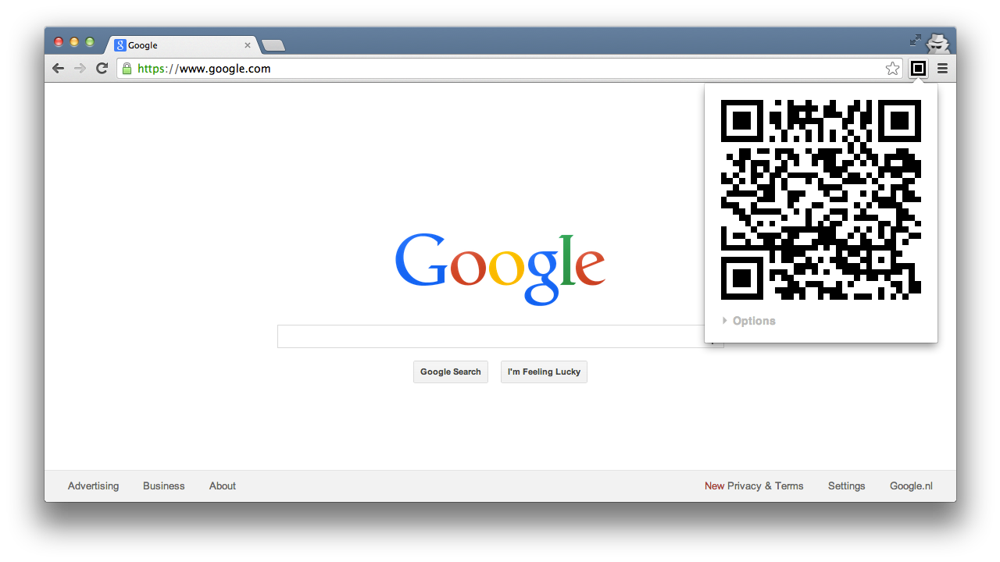
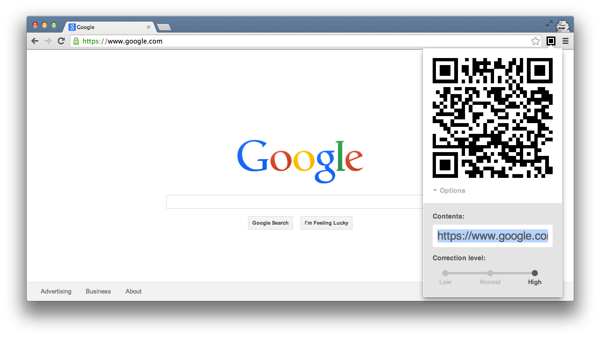

Local QR
========
Chrome Extension: A plain & simple QR-Code generator that doesn't use a 
web-services.

About
-----
There are alot of QRCode extensions available for Chrome users. However, most 
of them reply on a web-service to generate the images which is a serious 
privacy issue (the party in question can monitor your web-behaviour).

Instead of using web-services _Local QR_ does the generation of the 
QRCode image locally, it's a simple easy-to-use design optimized for quick 
usage.

Usage
-----
Get a QRCode of your current chrome tab just click the _Local QR_-icon or press
Shift-Alt-Q on your keyboard. This will directly display the QRCode with the
url in the active tab.
To change the contents click on _Options_.

Screenshots
-----------

- - -

#### Authors:
 * Koen Bollen <meneer@koenbollen.nl>
 * Jesse Dijkstra <mailto:mail@jessedijkstra.nl>
